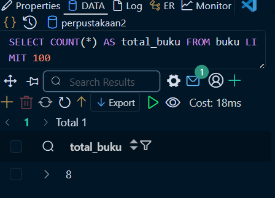
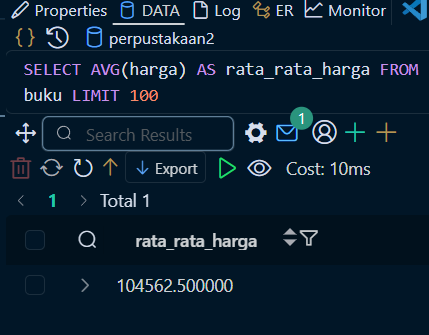

# Tugas 1: Eksplorasi Database Perpustakaan

## Hasil Query
### Statistik Buku
1. **Total buku seluruhnya**
    ![SELECT COUNT(*) AS total_buku FROM buku;]
2. **Total nilai inventaris (sum harga × stok)**
    )
3. **Rata-rata harga buku**
    
4. **Buku termahal (tampilkan judul dan harga)**
    )
5. **Buku dengan stok terbanyak**
    )
6. **Semua buku kategori Programming yang harga < 100.000**
    )
7. **Buku yang judulnya mengandung kata "PHP" atau "MySQL"**
    )
8. **Buku yang terbit tahun 2024**
    )
9. **Buku yang stoknya antara 5-10**
    )
10. **Buku yang pengarangnya "Budi Raharjo"**
    )
11. **Jumlah buku per kategori (dengan total stok per kategori)**
    )
12. **Rata-rata harga per kategori**
    )
13. **Kategori dengan total nilai inventaris terbesar**
    )
14. **Naikkan harga semua buku kategori Programming sebesar 5%**
    
15. **Tambah stok 10 untuk semua buku yang stoknya < 5**
    )
16. **Daftar buku yang perlu restocking (stok < 5)**
    )
17. **Top 5 buku termahal**
    )